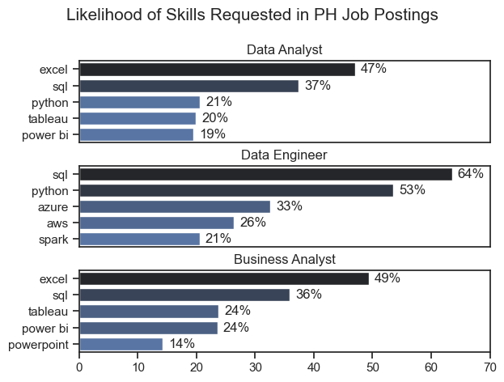
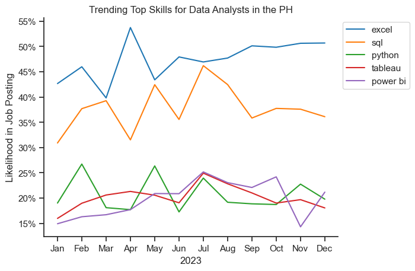
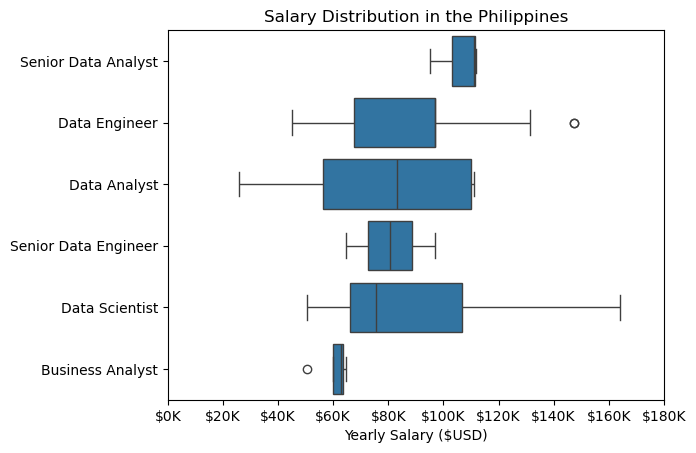
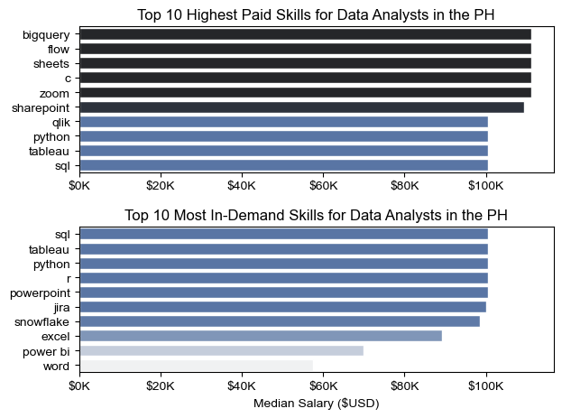
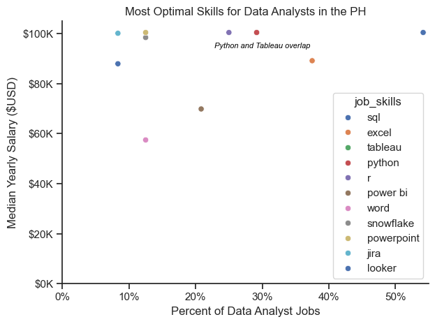

# Introduction

As an aspiring data analyst, I was curious about the current state of the data job market. 👩🏻‍💻 I already worked on a SQL project through Luke Barousse's Data Analytics course, which provided me with great insights about data roles. I decided to further my learnings with his Python course, which gave me the opportunity to unlock more insights with the help of visualizations. 📊 I analyzed data roles in the Philippines, focusing on salary levels, in-demand skills, and Data Analyst positions. Leveraging data from 2023 job postings, I used Python to visualize important insights on the data industry. Let's dive in! 🤓

# The Questions

These are the questions I wanted to find the answers to through this project:
1. What are the most demanded skills for the top 3 most popular data roles (in the Philippines)?
2. How are in-demand skills trending for Data Analysts?
3. How well do jobs and skills pay for Data Analysts?
4. What are the most optimal skills to learn for Data Analysts?

# Tools I Used

For this project, I used these key tools:

- **Python:** This allowed me to analyze the given data and uncover valuable insights. I also used these libraries:
    - **Pandas Library:** For analyzing data
    - **Matplotlib Library:** For visualizing data
    - **Seaborn Library:** For more advanced visualizations
- **Visual Studio Code:** This made executing Python scripts more convenient and efficient.
- **Git & Github:** These allowed me to share my Python scripts and analysis, and made sure versions were kept up to date.

# The Analysis

## 1. What are the most demanded skills for the top 3 most popular data roles?

First I created a new dataframe focusing on job postings in the Philippines. Then I grouped this by skill count to get the most in demand skills. I also filtered this out to get the top 5 skills for the top 3 most popular job titles. This highlights the skills demanded by the most popular job titles, so I know which skills to focus on depending on the role I want.

View my notebook with detailed steps here: [2_Skill_Demand.ipynb](3_Project/2_Skills_Count.ipynb)

### Visualize Data
```python
fig, ax = plt.subplots(len(job_titles), 1)

sns.set_theme(style='ticks')

for i, job_title in enumerate(job_titles):
    df_plot = df_skills_perc[df_skills_perc['job_title_short'] == job_title].head(5)
    sns.barplot(data=df_plot, x='skill_percent', y='job_skills', ax=ax[i], hue='skill_count', palette='dark:b_r')
    ax[i].set_title(job_title)
    ax[i].set_ylabel('')
    ax[i].set_xlabel('')
    ax[i].get_legend().remove()
    ax[i].set_xlim(0, 70)

    for n, v in enumerate(df_plot['skill_percent']):
        ax[i].text(v + 1, n, f'{v:.0f}%', va='center')

    if i != len(job_titles) - 1:
        ax[i].set_xticks([])

fig.suptitle('Likelihood of Skills Requested in PH Job Postings', fontsize=15)
fig.tight_layout(h_pad=0.5)
plt.show()
```

### Results


*Bar graph visualizing the most demanded skills for the top 3 most popular data roles in the PH in 2023.*

### Insights
- **High Demand for Excel:** Excel is highly demanded across all roles, with 47% for Data Analysts, 49% for Business Analysts, and not explicitly mentioned for Data Engineers.
- **SQL and Python Prevalence:** SQL is the top skill for Data Engineers (64%) and Data Analysts (37%), while Python is also highly sought after in these roles.
- **Data Engineer Specifics:** Azure and AWS are significant for Data Engineers, showing a need for cloud-related skills, with Azure at 33% and AWS at 26%.

*ChatGPT generated these insights based on my codes and visualizations*

## 2. How are in-demand skills trending for Data Analysts?

Now that I knew the in-demand skills for the top 3 roles in the PH, I wanted to see which skills had a steady demand throughout the year. I grouped the skill count by month posted, and calculated for the percentages that each skill was mentioned in the total number of job postings that month. Visualizing this data through a line graph made it easier for me to see if these skills were consistently in demand.

View my notebook with detailed steps here: [3_Skills_Trend.ipynb](3_Project/3_Skills_Trend.ipynb)

### Visualize Data

```python
df_plot = df_DA_PH_percent.iloc[:, :5]

sns.lineplot(data=df_plot, dashes=False, palette='tab10')
sns.set_theme(style='ticks')
sns.despine()

plt.title('Trending Top Skills for Data Analysts in the PH')
plt.ylabel('Likelihood in Job Posting')
plt.xlabel('2023')
plt.legend(loc='upper left', bbox_to_anchor=(1, 1))

from matplotlib.ticker import PercentFormatter
ax = plt.gca()
ax.yaxis.set_major_formatter(PercentFormatter(decimals=0))

plt.show()
```

### Results

*Line graph visualizing the trending top skills for data analysts in the PH in 2023.*

### Insights

- **Excel and SQL Dominate:** Excel and SQL consistently show the highest likelihood in job postings, with Excel peaking above 50% and SQL around 45%.
- **Python's Volatility:** Python has a lower but significant demand, showing fluctuations throughout the year, peaking around 25%.
- **Power BI and Tableau Steady:** Both Power BI and Tableau have a lower but stable demand, generally hovering between 15-25%.

*ChatGPT generated these insights based on my codes and visualizations*

## 3. How well do jobs and skills pay for Data Analysts?

### Salary Analysis for Data Roles

I wanted to analyze the salaries of the top 6 data roles in the Philippines. To do this, I dropped the rows with null values in average yearly salary and then got the top 6 roles. I then visualized the data using a boxplot so it could show me the salary range of each role and compare salaries across roles.

View my notebook with detailed steps here: [4_Salary_Analysis.ipynb](3_Project/4_Salary_Analysis.ipynb)

### Visualize Data

```python
sns.boxplot(data=df_PH_top6, x='salary_year_avg', y='job_title_short', order=job_order)

plt.title('Salary Distribution in the Philippines')
plt.xlabel('Yearly Salary ($USD)')
plt.ylabel('')
plt.xlim(0, 180000)
ax = plt.gca()
ax.xaxis.set_major_formatter(plt.FuncFormatter(lambda x, pos: f'${int(x/1000)}K'))
plt.show()
```

### Results

*Box plot visualizing the salary distribution for data roles in the PH in 2023.*

### Insights

- **Wide Salary Range for Data Scientists:** Data Scientists have the broadest salary range, spanning from around $40K to $160K, indicating a significant variation in pay within this role.
- **Senior Roles Command Higher Pay:** Senior Data Analysts and Senior Data Engineers have higher median salaries compared to their non-senior counterparts, reflecting the premium on experience and seniority.
- **Concentrated Salary for Business Analysts:** Business Analysts show a relatively narrow salary range centered around $60K, suggesting more consistency in pay for this role.

*ChatGPT generated these insights based on my codes and visualizations*

### Highest Paid & Most Demanded Skills for Data Analysts

Then, I zeroed in on Data Analyst roles. I wanted to know what the highest paid skills associated with Data Analyst roles were, and how this compared with the most in-demand skills. I visualized this using bar charts depicting the top 10 highest paid skills vs. the top 10 most in-demand skills.

View my notebook with detailed steps here: [4_Salary_Analysis.ipynb](3_Project/4_Salary_Analysis.ipynb)

### Visualize Data

```python
fig, ax = plt.subplots(2, 1)

sns.set_theme(style='ticks')

sns.barplot(data=df_DA_top_pay, x='median', y=df_DA_top_pay.index, ax=ax[0], hue='median', palette='dark:b_r')
ax[0].legend().remove()

ax[0].set_title('Top 10 Highest Paid Skills for Data Analysts in the PH')
ax[0].set_ylabel('')
ax[0].set_xlabel('')
ax[0].xaxis.set_major_formatter(plt.FuncFormatter(lambda x, _: f'${int(x/1000)}K'))


sns.barplot(data=df_DA_skills, x='median', y=df_DA_skills.index, ax=ax[1], hue='median', palette='light:b')
ax[1].legend().remove()

ax[1].set_title('Top 10 Most In-Demand Skills for Data Analysts in the PH')
ax[1].set_ylabel('')
ax[1].set_xlabel('Median Salary ($USD)')
ax[1].set_xlim(ax[0].get_xlim())
ax[1].xaxis.set_major_formatter(plt.FuncFormatter(lambda x, _: f'${int(x/1000)}K'))

fig.tight_layout()
plt.show()
```

### Results

*Bar Charts visualizing the top 10 highest paid and most in-demand skills for data analysts in the PH in 2023.*

### Insights

- **Highest Paid Skills:** Skills like BigQuery, Flow, and Sheets command the highest median salaries, all over $100K, indicating their premium value in the job market.
- **In-Demand Skills:** SQL, Tableau, and Python are the most sought-after skills, appearing at the top of the demand chart, highlighting their critical importance for data analyst roles.
- **Overlap of Skills:** Python and Tableau are both highly paid and in-demand, making them valuable for aspiring data analysts to learn.

*ChatGPT generated these insights based on my codes and visualizations*

## 4. What is the most optimal skill to learn for Data Analysts?

I discovered what the highest paid and most in-demand skills for data analysts were, but which skills are most important to focus on? Which ones are highly sought after as well as highly paid? How do these compare to the other skills? To gather insights, I calculated for the likelihood each skill would be mentioned in a Data Analyst job posting. I compared this to the median salary associated with each skill, and visualized this on a scatterplot.

View my notebook with detailed steps here: [5_Optimal_Skills.ipynb](3_Project/5_Optimal_Skills.ipynb)

### Visualize Data

```python
from adjustText import adjust_text
from matplotlib.ticker import PercentFormatter

sns.scatterplot(data=df_DA_skills_high_demand, x='skill_percent', y='median_salary', hue='job_skills', palette='deep')
sns.despine()
sns.set_theme(style='ticks')

# df_DA_skills_high_demand.plot(kind='scatter', x='skill_percent', y='median_salary')

# texts = []
# for i, txt in enumerate(df_DA_skills_high_demand.index):
#   texts.append(plt.text(df_DA_skills_high_demand['skill_percent'].iloc[i], df_DA_skills_high_demand['median_salary'].iloc[i], txt))

# adjust_text(texts, arrowprops=dict(arrowstyle="->", color='gray', lw=1))

ax = plt.gca()
ax.yaxis.set_major_formatter(plt.FuncFormatter(lambda y, pos: f'${int(y/1000)}K'))
ax.xaxis.set_major_formatter(PercentFormatter(decimals=0))
ax.text(30, 95000, "Python and Tableau overlap", fontsize = 8, fontstyle = "oblique", color = "black", ha = "center", va = "center")

plt.xlabel('Percent of Data Analyst Jobs')
plt.ylabel('Median Yearly Salary ($USD)')
plt.title('Most Optimal Skills for Data Analysts in the PH')
plt.xlim(0, 55)
plt.ylim(0, 105000)
plt.tight_layout()
plt.show()
```

### Results

*Scatterplot visualizing the most optimal skills for data analysts in the PH in 2023.*

### Insights

- **High Demand and High Salary:** SQL is highly demanded, appearing in about 54% of job postings, and commands a relatively high median salary, making it a crucial skill for data analysts.
- **Python and Tableau:** These skills overlap, indicating that both are frequently requested and offer competitive salaries around $100K. This suggests that proficiency in both could be highly advantageous.
- **Specialized High-Paying Skills:** Skills like Looker and Snowflake offer high median salaries (around $88-99K) but are mentioned in fewer job postings, indicating they are specialized but well-compensated.

*ChatGPT generated these insights based on my codes and visualizations*


# What I Learned

Throughout this project, I've added some valuable skills to my Python toolkit:
- 📦 Installing Packages: Using packages such as pandas, matplotlib, and seaborn is essential when it comes to making your code simpler and more efficient. With these tools, I was able to execute commands in a matter of seconds with just a few lines of code. This made my code neater and easier to read, and saved so much time.
- 📉 Visualizing Data: Sometimes data can be overwhelming or too difficult to understand on its own. With the help of visualizations, data can reveal so many important insights. I've learned to create a variety of visualizations from bar graphs to scatter plots, to help me understand the complex narratives data can tell.
- ❗️ Troubleshooting Errors: Even the smallest typo in code can cause the most confusing errors. I've run into a few errors that had me scratching my head and staring at my screen for hours. With the help of ChatGPT and online forums, I was able to understand the roots of some errors and learn how to avoid or tackle them. It's inevitable to make mistakes in code; we just need the patience to solve them.

# Conclusions

Based on this project, here are five insights into the data job market in the Philippines:

1. **High Demand for Core Skills:** SQL and Excel are highly demanded across various data roles, making them essential for data analysts, engineers, and scientists.
2. **Competitive Salaries for Specialized Skills:** Skills like BigQuery, Flow, and Looker command high median salaries, indicating a premium for specialized knowledge.
3. **Importance of Versatility:** Python and Tableau are both high-paying and in-demand, emphasizing the need for versatility in analytical and visualization tools.
4. **Entry-Level Variation:** Entry-level data analyst salaries range widely, showing potential for growth with experience and skill development.
5. **Senior Roles Pay More:** Senior positions, such as Senior Data Analysts and Senior Data Engineers, offer higher median salaries, reflecting the value of experience and advanced expertise.

*ChatGPT generated these insights based on my codes and visualizations*

# Closing Thoughts

After taking Luke Barousse's SQL project, I decided to take things a step further by working on my Python skills as well. 🐍 As an aspiring data analyst, I wanted to make sure I had these skills in my toolkit. Working on this project solidified my understanding that skills like SQL, Python, and Excel were essential for a data analyst. It's amazing that while practicing Python with the aim of becoming a data analyst, I was actually able to learn so much more about the data job market! 💡 I realized that Python is such a powerful tool for data, especially with all the packages available for people to use to make their workflow smoother and more efficient. I was able to create data visualizations that provided snapshots of real-life situations in the job market. Overall, this whole project made me more confident in my ability to write Python code, and unlocked many valuable insights that I'll use in my job search. 🤓